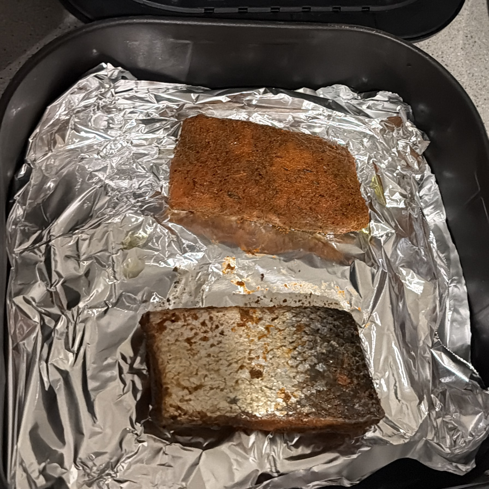

# Agentic Salmon

**Owner:** Joseph Shi — [aixstudio](https://github.com/aixstudio) — Principal Architect - Agentic AI & Data Platform | I build with Python

> The agent refused to hallucinate dinner. That is when the architecture started working.

Agentic Salmon is a locally runnable proof of controlled agentic architecture,
not a cooking application or a chat-wrapper demo. It turns one deliberately
ambiguous real-world observation into an auditable journey through evidence,
ontology, semantic retrieval, human authority, bounded action, and learning:

```text
GUARD ⊣ [PERCEIVE → CONNECT → REASON → REVIEW → ACT → LEARN]
```

Each name is an executable cognitive ownership boundary. Guard is not a seventh
agent; it controls which transitions and actions are permitted. LangGraph
schedules and checkpoints the six contracts and pauses at a real human Review
interrupt.

## Architecture at a Glance

The architecture is deliberately read top to bottom: Guard defines the control
envelope, the six agents own judgment, and the execution layer supplies
orchestration, knowledge tools, retrieval, and evidence capture.

```mermaid
%%{init: {"theme":"dark","themeVariables":{"fontSize":"22px","primaryTextColor":"#F8FAFC","lineColor":"#94A3B8","clusterBkg":"#111827","clusterBorder":"#475569","edgeLabelBackground":"#111827"},"flowchart":{"nodeSpacing":32,"rankSpacing":52,"htmlLabels":true,"curve":"basis"}}}%%
flowchart TB
    subgraph GUARD_BAND[" "]
        direction TB
        subgraph GUARD_ROW[" "]
            direction LR
            G["<span style='font-size:32px'><b>GUARD</b></span><br/><span style='font-size:20px'>governs every transition</span>"]
            TP["<span style='font-size:24px'><b>Transition Policy</b></span><br/><span style='font-size:18px'>what may advance</span>"]
            AE["<span style='font-size:24px'><b>Authority Envelope</b></span><br/><span style='font-size:18px'>what may be released</span>"]
            G ==> TP ==> AE
        end
    end

    subgraph AGENT_BAND[" "]
        direction TB
        subgraph AGENT_ROW[" "]
            direction LR
            LOOP["<span style='font-size:30px'><b>AGENTIC LOOP</b></span><br/><span style='font-size:20px'>six cognitive agents</span>"]
            P["<span style='font-size:28px'><b>PERCEIVE</b></span><br/><span style='font-size:18px'>sense + separate</span>"]
            C["<span style='font-size:28px'><b>CONNECT</b></span><br/><span style='font-size:18px'>resolve + assemble</span>"]
            R["<span style='font-size:28px'><b>REASON</b></span><br/><span style='font-size:18px'>evaluate + propose</span>"]
            V["<span style='font-size:28px'><b>REVIEW</b></span><br/><span style='font-size:18px'>human judgment</span>"]
            A["<span style='font-size:28px'><b>ACT</b></span><br/><span style='font-size:18px'>bounded intervention</span>"]
            L["<span style='font-size:28px'><b>LEARN</b></span><br/><span style='font-size:18px'>verify + retain</span>"]
            LOOP ==> P ==> C ==> R ==> V
            V ==>|<span style='font-size:18px'><b>ALLOW_BOUNDED</b></span>| A ==> L
        end
    end

    subgraph LANGGRAPH_BAND[" "]
        direction TB
        subgraph LANGGRAPH_ROW[" "]
            direction LR
            LG["<span style='font-size:30px'><b>LANGGRAPH</b></span><br/><span style='font-size:20px'>nodes schedule work</span>"]
            N1["<span style='font-size:22px'><b>Capture Evidence</b></span><br/><span style='font-size:17px'>observations · unknowns · provenance</span>"]
            N2["<span style='font-size:22px'><b>Assemble Event</b></span><br/><span style='font-size:17px'>ontology · entities · relationships</span>"]
            N3["<span style='font-size:22px'><b>Evaluate Hypotheses</b></span><br/><span style='font-size:17px'>semantic RAG · MCP · citations</span>"]
            N4["<span style='font-size:22px'><b>Human Interrupt</b></span><br/><span style='font-size:17px'>ASK · STOP · ALLOW_BOUNDED</span>"]
            N5["<span style='font-size:22px'><b>Release Action</b></span><br/><span style='font-size:17px'>authorized guidance only</span>"]
            N6["<span style='font-size:22px'><b>Record Outcome</b></span><br/><span style='font-size:17px'>result · policy effect · audit trace</span>"]
            LG ==> N1 ==> N2 ==> N3 ==> N4
            N4 ==>|<span style='font-size:17px'><b>ALLOW_BOUNDED</b></span>| N5 ==> N6
        end
    end

    GUARD_BAND -. "control contract" .-> AGENT_BAND
    AGENT_BAND == "agents own judgment · nodes schedule" ==> LANGGRAPH_BAND

    classDef agent fill:#0F3B57,stroke:#38BDF8,stroke-width:3px,color:#F8FAFC;
    classDef artifact fill:#1F2937,stroke:#94A3B8,stroke-width:2px,color:#F8FAFC;
    classDef bandLabel fill:#111827,stroke:#E0A800,stroke-width:4px,color:#F8FAFC;
    classDef guard fill:#3F1D52,stroke:#C084FC,stroke-width:4px,color:#F8FAFC;
    class P,C,R,V,A,L agent;
    class N1,N2,N3,N4,N5,N6,TP,AE artifact;
    class G guard;
    class LOOP,LG bandLabel;
    style GUARD_ROW fill:transparent,stroke:transparent
    style AGENT_ROW fill:transparent,stroke:transparent
    style LANGGRAPH_ROW fill:transparent,stroke:transparent
```



Guard is orthogonal to the agent sequence: it constrains transitions and release
authority but does not perform a seventh cognitive task. LangGraph is likewise
not an agent; it schedules and checkpoints the contracts. Reason reaches
reviewed knowledge through MCP, so retrieval infrastructure can change without
rewriting Reason or the six-agent control model.

## Technology Stack and Rationale

| Technology | Role in this demo | Why it was chosen |
| --- | --- | --- |
| Python 3.13 | Typed local runtime and distributable package | Keeps the implementation readable, portable, and easy to inspect in VS Code while holding the demo to one validated runtime. |
| LangGraph `StateGraph` | State transitions, checkpoints, Review interrupt, and same-run resume | Makes orchestration explicit and separates node scheduling from agent judgment. |
| MCP Python SDK over stdio | Real client/server `search_knowledge` tool boundary | Proves that knowledge and future business tools are pluggable through a protocol boundary rather than embedded inside an agent. |
| FastEmbed with `BAAI/bge-small-en-v1.5` | Local dense embeddings for semantic retrieval | Demonstrates semantic RAG without an API key, hosted model, or keyword-only shortcut. |
| In-memory cosine ranking | Ranks the reviewed embedded chunks | Preserves the retrieval contract while avoiding a vector database that would add setup but no new architectural proof. |
| Reviewed JSON corpus with SHA-256 integrity | Self-contained knowledge sources, chunks, citations, and provenance | Makes retrieval evidence inspectable and tamper-detectable; it can later be replaced by governed enterprise content. |
| Typed Python models and a governed ontology | Stage artifacts, entity kinds, relationships, decisions, and authority | Turns the six agent names into testable contracts and rejects invalid semantic or control transitions. |
| JSON and Markdown traces plus `unittest` | Audit output and deterministic contract tests | Gives an evaluator observable evidence without publishing prompts or hidden reasoning. |

## Why This Matters

Most agent demos emphasize whether a model can produce an answer. This demo
tests the harder architectural question: **should the system be allowed to act
on the evidence it actually has?** The photograph contains useful evidence, but
it does not prove identity, freshness, allergens, storage history, or safety.

The significant result is therefore not a clever food answer. It is a governed
system that preserves uncertainty, retrieves reviewed knowledge through a
replaceable interface, requires explicit human authority, cites the basis of
its bounded guidance, and prevents later outcome feedback from weakening its
safety policy.



## What the Demo Proves

| Demo point | Evidence to observe |
| --- | --- |
| Six owned agent contracts | The trace advances through Perceive, Connect, Reason, Review, Act, and Learn; each stage produces its own artifact. |
| Ontology-driven connection | Connect resolves mentions into typed entities and validates their relationships before reasoning proceeds. |
| Pluggable semantic RAG | Reason calls a real local MCP tool and returns the embedding model, ranked chunks, scores, citations, duration, and protocol metadata. |
| Human-in-the-loop authority | Review interrupts the graph and requires a valid working hypothesis, acceptance of retained unknowns, and explicit authorization. |
| Guarded action | An `unknown` hypothesis cannot authorize Act; only a supported or plausible selection can release bounded, cited guidance. |
| Policy-safe learning | Learn records outcome and preference evidence but cannot use a successful outcome to weaken safety or authority policy. |
| Auditability | The JSON result and local report expose timestamps, stage artifacts, decisions, retrieval evidence, and retained unknowns without exposing hidden reasoning. |

The RAG plug-in is intentionally small: a reviewed JSON corpus, FastEmbed dense
embeddings, and in-memory cosine ranking. It proves that semantic retrieval can
be plugged into the agent contract through MCP without requiring pgvector, a
hosted service, or credentials.

## Why the Implementation Is Intentionally Thin

The goal is architectural signal, not infrastructure volume. A larger stack
could hide the decisions being demonstrated behind cloud setup, databases, UI
frameworks, and vendor-specific services. This thin layer keeps the complete
control path visible and runnable on a laptop while retaining real seams:
agent contracts, ontology validation, LangGraph state and interruption, an MCP
boundary, semantic retrieval, authority policy, citations, and audit evidence.

Thin does not mean closed or domain-specific. It means the demonstration uses
the smallest implementation that preserves replaceable boundaries. To move into
another business domain, the architecture can evolve by replacing or expanding
the components behind those boundaries:

| Demo component | Scaled business-domain upgrade |
| --- | --- |
| Reviewed image fixture and provider | Domain events, documents, APIs, streams, or multimodal evidence with provenance |
| Kitchen ontology | A versioned domain ontology, entity-resolution service, and governed semantic model |
| JSON corpus and in-memory embeddings | Governed enterprise content, hybrid/vector retrieval, access control, reranking, and evaluation |
| One local MCP knowledge server | Multiple authenticated MCP servers and domain toolsets with scoped permissions |
| One node per agent contract | Multiple tools, models, workers, or subgraphs behind the same owned agent responsibility |
| CLI Review interrupt | Approval queues, case-management UI, policy service, and role-based authority |
| Local JSON and Markdown traces | Durable event storage, observability, compliance evidence, and continuous evaluations |

The stable architectural idea is the governed contract between evidence,
judgment, authority, and action. The infrastructure underneath each contract
can scale with the domain. This repository demonstrates that upgrade path; it
does not claim that the laptop-sized implementation is itself a production
enterprise platform.

## Evidence Boundary

No original packaging or label was available. The photograph supports visible
observations such as two portions, seasoning, skin, and the air-fryer basket. It
cannot establish species, ingredients, allergens, smell, storage history,
freshness, or safety. The human may select `fish` as the evidence-supported
working hypothesis while Reason keeps `salmon` separate and merely plausible.
Neither is treated as verified identity.

## Prerequisite — Python 3.13 Virtual Environment

Use Python 3.13.x for this demo. Python 3.14 is intentionally excluded until
the dependency set is validated against it.

On macOS with Homebrew:

```bash
brew install python@3.13
$(brew --prefix python@3.13)/bin/python3.13 -m venv --clear .venv
.venv/bin/python --version  # Expect Python 3.13.x
```

`--clear` safely replaces a `.venv` previously created with Python 3.14. If
Python 3.13 is already installed, `python3.13 -m venv --clear .venv` is
sufficient. Creating `.venv` is setup, not a demo step.

## Run the Three-Step Demo

Run all commands from the repository root.

The three runs are a progressive assurance sequence, not three duplicate ways
to launch the program:

| Run | Control question | What it proves |
| --- | --- | --- |
| 1. Governed interrupt | What happens before a human grants authority? | Retrieval and reasoning do not imply permission to act; the default path stops at Review. |
| 2. Interactive HITL | Can a human provide the missing judgment and authority without erasing uncertainty? | The graph validates the selection, retained unknowns, and bounded authorization before Act and Learn can run. |
| 3. Non-interactive authorized run | Can the same governed contract be invoked repeatably by automation? | Human evidence can be supplied explicitly through a machine-runnable interface while preserving the same Guard, citations, stages, and policy outcome. |

### Step 1 — Install and Reach the Governed Interrupt

```bash
.venv/bin/python -m pip install -e .
.venv/bin/python -m agentic_salmon demo
```

The editable install makes the local package runnable. On the first demo run,
the configured `BAAI/bge-small-en-v1.5` embedding model may be downloaded. The
workflow then calls the local MCP server, performs semantic retrieval, and
stops at the Review interrupt.

**What this proves:** the system is deny-by-default. Perceive, Connect, Reason,
RAG, and MCP may assemble useful evidence, but none of them can silently grant
Act permission.

**Expected outcome:** `status` is `interrupted`, `decision` is `ask`, and the
completed stages are `perceive`, `connect`, and `reason`. `guidance` remains
`null`; neither Act nor Learn runs before a human decision. This interruption
is the expected success condition, not an incomplete run.

### Step 2 — Complete the Interactive HITL Review

The interactive runner displays Reason's offered hypotheses and resumes the
same run only after valid human input:

```bash
.venv/bin/python -m agentic_salmon demo --interactive \
  --outcome "390°F for 14 minutes; wonderful and fresh-tasting" \
  --feedback "moderately spicy result preferred"
```

Answer the Review prompts as follows for the authorized demonstration:

```text
Choose a number, hypothesis key, or 'stop': 2
Accept the displayed retained unknowns? [y/N]: y
Authorize only bounded cited guidance? [y/N]: y
Storage recollection (optional): retrieved frozen from home freezer; exact cold chain unknown
Odor observation (optional): seasoning smelled reminiscent of lasagna
```

Choice `2` is the displayed `fish` hypothesis; entering the stable key `fish`
is equivalent. The runner also displays `Korean-spiced soup food` as unknown
and not action eligible, and `salmon` as plausible. Entering an invalid or
ineligible choice produces a validation message and does not advance. Entering
`stop`, answering `n`, or pressing Enter at either authorization prompt prevents
Act from releasing guidance. The storage and odor answers are evidence inputs,
not proof of identity or freshness.

**What this proves:** HITL is an enforceable control contract, not a decorative
approval screen. The human must choose an eligible hypothesis, acknowledge the
remaining uncertainty, and explicitly constrain the authority being granted.

**Expected outcome:** after the five answers above, `status` is `completed`,
`decision` is `allow_bounded`, and all six stages run in order. Act keeps food
identity unverified and cites reviewed 145°F thermometer guidance. Learn records
the supplied outcome and preference while reporting that they have no effect on
safety or authority policy.

### Step 3 — Run the Non-Interactive Authorized Path

This form supplies the same human evidence as command-line arguments, which is
useful for repeatable demonstrations and automation:

```bash
.venv/bin/python -m agentic_salmon demo \
  --review allow-bounded \
  --selected-hypothesis "fish" \
  --storage-recollection "retrieved frozen from home freezer; exact cold chain unknown" \
  --odor-observation "seasoning smelled reminiscent of lasagna" \
  --outcome "390°F for 14 minutes; wonderful and fresh-tasting" \
  --feedback "moderately spicy result preferred"
```

**What this proves:** the governance model is independent of the interactive
CLI. A script, test harness, service, or future business workflow can supply the
same typed Review evidence and receive the same controlled stage progression.

**Expected outcome:** no interactive prompt appears. The result is `completed`
with `decision: allow_bounded`; the trace contains all six stages, Act cites the
reviewed USDA temperature chunk, and Learn records the outcome and preference
with `policy_effect: none`. The 390°F/14-minute values remain historical outcome
evidence—not a universal recipe or proof of identity, freshness, or safety.

An ignored Markdown report is also written under `traces/`.

## Test

```bash
LANGGRAPH_STRICT_MSGPACK=true .venv/bin/python -m unittest discover -s tests -v
```

The deterministic tests do not download the embedding model. They cover all six
agent contracts, ontology violations, semantic ranking, a real in-process MCP
tool call, Review interruption/resume, Guard rejection, citation enforcement,
and exclusion of hidden prompt/reasoning fields from public traces.

## Architecture Notes

- [Controlled workflow decision](docs/adr/0001-controlled-workflow.md)
- [Connect and ontology](docs/ontology.md)
- [Threat model](docs/threat-model.md)
- [True story and evidence boundaries](docs/story.md)
- [Image provenance](docs/image-provenance.md)
- [AI assistance disclosure](docs/ai-assistance.md)

## Safety

This is an architecture demonstration, not food-safety, medical, allergy, or
nutritional advice. It does not determine freshness or safety from an image.
USDA guidance says fish should reach **145°F (62.8°C)** as measured with a food
thermometer; appliance time and temperature alone are not proof of doneness.

Source: [USDA Air Fryers and Food Safety](https://www.fsis.usda.gov/food-safety/safe-food-handling-and-preparation/food-safety-basics/air-fryers-and-food-safety).
