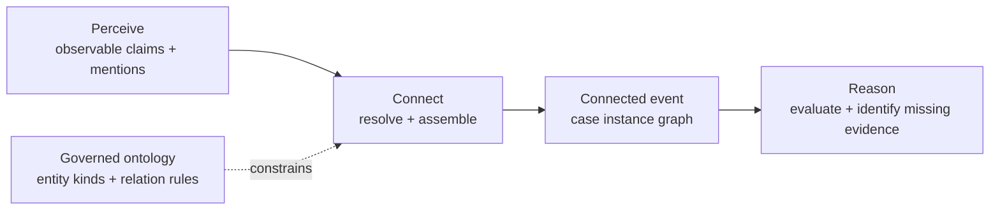
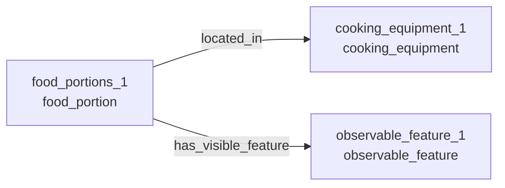

# Connect and the Agentic Salmon Ontology

Connect is a first-class workflow capability because deciding what belongs together is different from deciding what it means.

## Governed Meaning

The small ontology permits only these entity kinds and relationships:

| Subject | Relationship | Object |
| --- | --- | --- |
| `food_portion` | `located_in` | `cooking_equipment` |
| `food_portion` | `has_visible_feature` | `observable_feature` |

The ontology is the reusable semantic contract. It says which relationship shapes are meaningful; it does not claim that a relationship occurred.

## Case Instance Graph

The reviewed fixture supplies unresolved, evidence-bound mentions from the real input image. Connect applies the event-scoped resolution policy, maps those mentions to canonical IDs, validates the ontology, and emits this case-specific graph:

Every emitted entity and relationship retains an evidence claim. An unknown mention, conflicting entity kind, missing endpoint, or disallowed relationship fails the Connect stage instead of leaking ambiguity into Reason.

## Ownership Boundary

- Perceive answers: what observations, sourced candidate hypotheses, unknowns, and unresolved mentions arrived?
- Connect answers: which entities and relationships form this event?
- Reason answers: what does the connected event mean, and what evidence is still missing?

That separation keeps entity resolution visible, testable, and reusable without turning the demonstration into a general knowledge graph platform.
